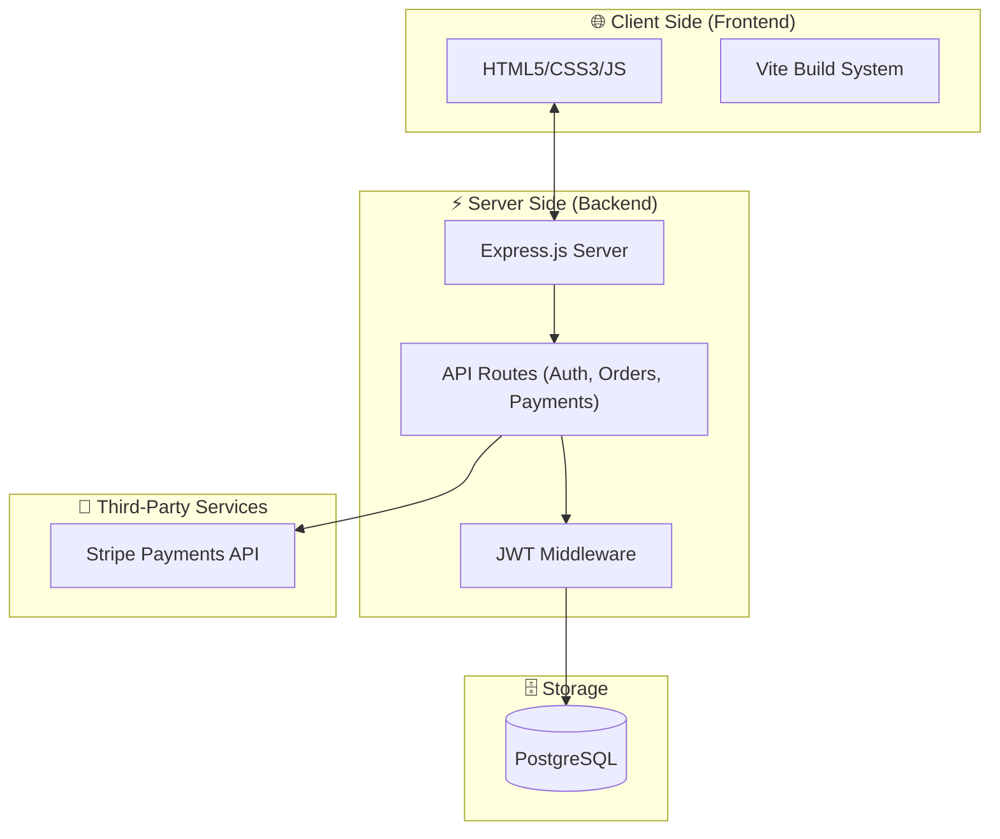

# 🚀 WEBOCONTROL - Advanced Software Solutions for Startups

[](https://webocontrol.vercel.app)
[](https://github.com/hamzax180/webocontrol-website)

**WEBOCONTROL** is a specialized software development agency platform designed to accelerate startups. It features a robust order management system, secure authentication, and seamless payment integration.

🔗 **Live Demo:** [webocontrol.vercel.app](https://webocontrol.vercel.app)

---

## 🏗 Architecture Overview

The application follows a **Decoupled Monolith** pattern, where the frontend (Vite/Static) communicates with a Node/Express API, both hosted on Vercel.



---

## 🛠 Tech Stack

### Frontend
- **HTML5 & CSS3**: Professional, high-conversion UI/UX designed for modern startups.
- **JavaScript**: Vanilla JS for logic and DOM manipulation.
- **Vite**: Modern frontend build tool for optimization and fast development.

### Backend
- **Node.js & Express**: High-performance API server.
- **PostgreSQL**: Reliable relational database for storing users, orders, and reviews.
- **JWT (JSON Web Tokens)**: Secure, stateless authentication.
- **Bcrypt.js**: Industry-standard password hashing.
- **Stripe**: Enterprise-grade payment processing.

---

## 🚀 Key Features

- **🔐 Secure Authentication**: JWT-based login and registration system with hashed passwords.
- **🛒 Dynamic Order System**: Clients can request custom software with detailed specifications.
- **💳 Integrated Payments**: Secure checkout flow via Stripe.
- **📊 User Dashboard**: Personalized view for users to track orders and status.
- **💬 Review System**: Integrated feedback loop for clients.
- **📱 Responsive Design**: Fully optimized for mobile, tablet, and desktop.
- **🤖 Advanced AI Agents**: Autonomous, startup-focused agents for workflow automation (Price: $500).

---

## 📂 Project Structure

```bash
├── backend/            # Express.js server logic
│   ├── middleware/     # Auth & validation guards
│   ├── routes/         # API endpoint definitions (auth, orders, etc.)
│   ├── db.js           # Database connection & initialization
│   └── index.js        # Server entry point
├── frontend/           # Static assets, HTML, and CSS
│   ├── css/            # Modular stylesheets
│   ├── assets/         # Images & static media
│   └── *.html          # Landing pages & functional views
├── scripts/            # Utility scripts (admin creation, tests)
├── package.json        # Project dependencies & scripts
├── vercel.json         # Vercel deployment configuration
└── vite.config.js      # Vite build configuration
```

---

## ⚙️ Setup & Installation

### 1. Clone the repository
```bash
git clone https://github.com/hamzax180/webocontrol-website.git
cd webocontrol-website
```

### 2. Install Dependencies
```bash
npm install
```

### 3. Environment Configuration
Create a `.env` file in the root directory and add the following:
```env
DATABASE_URL=your_postgresql_url
JWT_SECRET=your_secret_key
STRIPE_SECRET_KEY=your_stripe_key
PORT=3001
```

### 4. Run Development Server
```bash
# Start backend and frontend (via Vite)
npm run dev
```

---

## 🗺 API endpoints

| Method | Endpoint | Description |
| :--- | :--- | :--- |
| `POST` | `/api/auth/register` | User registration |
| `POST` | `/api/auth/login` | User login (returns JWT) |
| `GET` | `/api/orders` | Fetch user orders (Protected) |
| `POST` | `/api/orders` | Create new order request |
| `POST` | `/api/payments/create-checkout-session` | Initialize Stripe session |

---

## 🗃 Database Schema

The system uses a PostgreSQL schema with three primary tables:
- `users`: Stores member credentials and roles.
- `orders`: Tracks software development requests, budgets, and payment status.
- `reviews`: Manages client feedback and ratings.

---

## 📄 License
This project is licensed under the **ISC License**.

---

<p align="center">
  Developed with ❤️ by <b>WEBOCONTROL Team</b>
</p>
